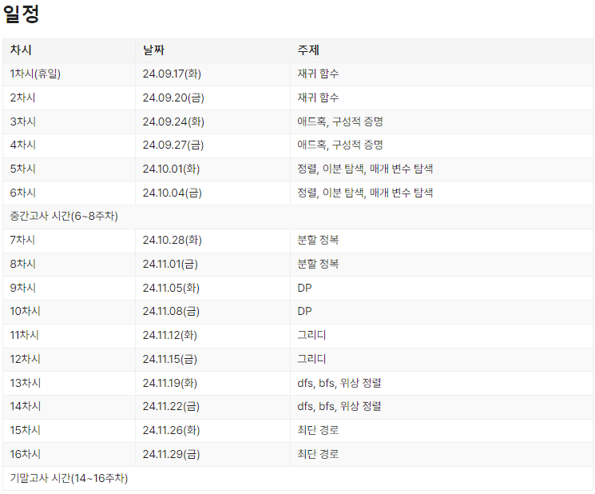

# 2024-2 기초 연습
진민성

---

# 진행방식
- 1주에 문제가 10~20문제 정도 제공됩니다.
- 화 (개념강의 & 문제풀이), 목 (문제 풀이)
- 개념 강의 
    - 기초 강의와 같이 [jhnah917님의 자료](https://github.com/justiceHui/SSU-SCCC-Study)를 바탕으로 개념을 가르칩니다.
- 문제 풀이
    - 스터디 전 문제를 미리 풀어옵니다.
    - 문제마다 풀어온 사람중 랜덤하게 자신의 풀이를 발표합니다.
    - 마지막으로 제가 문제의 접근 방식과 풀이를 설명합니다.

---

# 문제
https://www.acmicpc.net/group/21908
백준 그룹 연습에서 문제를 확인하실 수 있습니다.

---

# 일정

https://sccc.kr/study/2024/2

---

# 한국정보올림피아드위원회 공식 유튜브 채널
[IOI KOREA](https://youtu.be/8cSjBQtqEXY)
